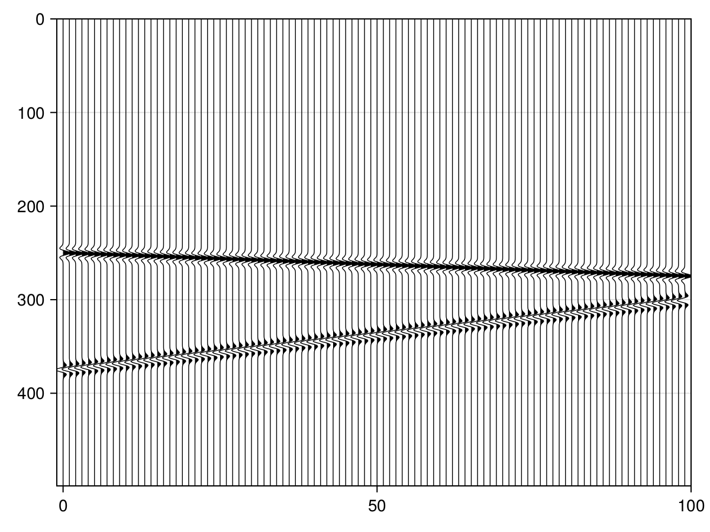
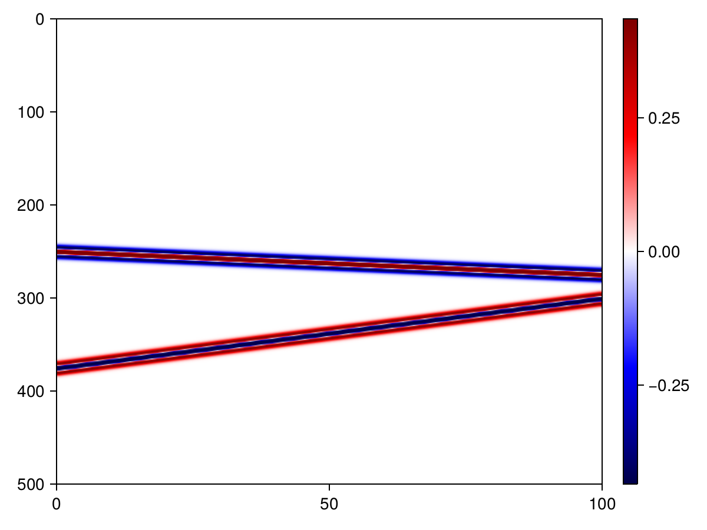
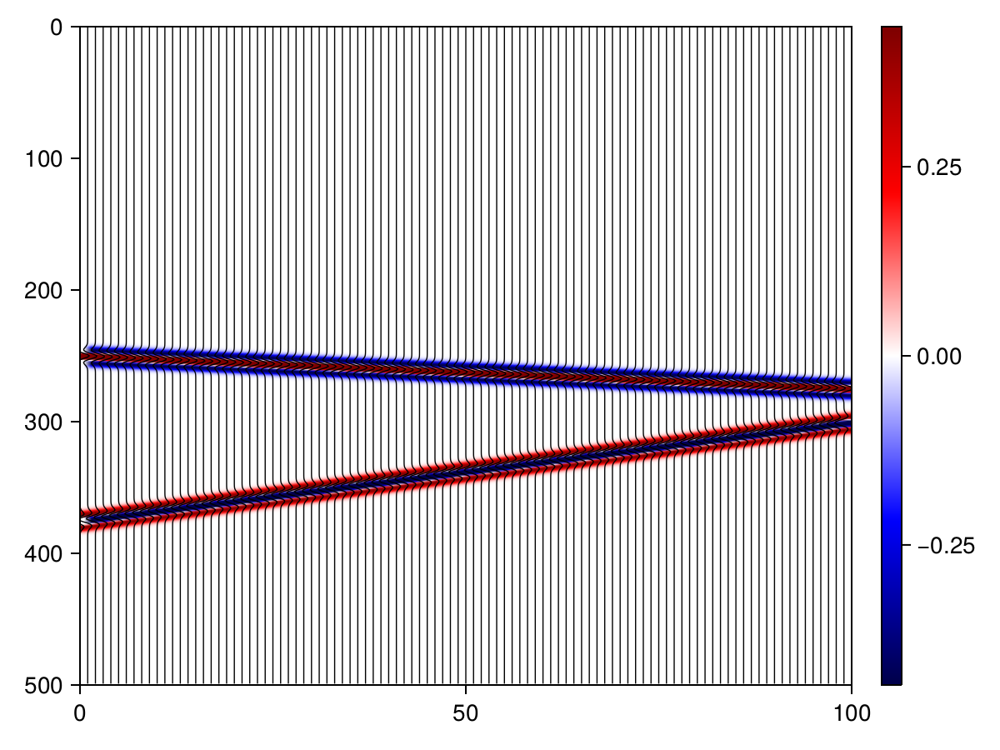
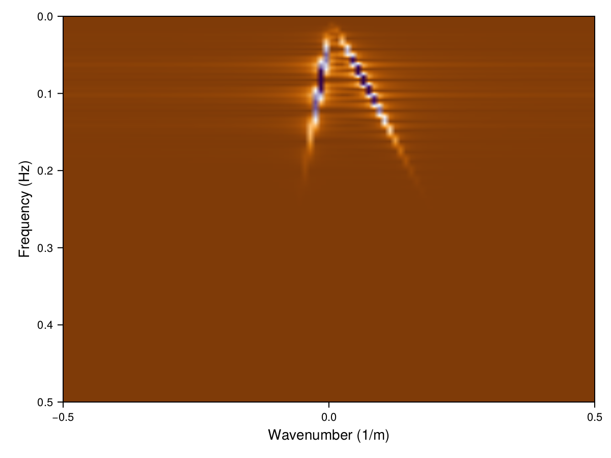

# SeisMakie

[](https://seismicjulia.github.io/SeisMakie.jl/stable/)
[](https://seismicjulia.github.io/SeisMakie.jl/dev/)
[](https://github.com/SeismicJulia/SeisMakie.jl/actions/workflows/CI.yml?query=branch%3Amain)

SeisMakie.jl is a package intended for plotting seismic data. Some examples are wiggle, image, overlay and frequency-wavenumber plots.

## Examples

### Wiggle Plot

```julia
using CairoMakie, SeisProcessing

# Seismic data consisting of linear events
d = SeisLinearEvents()
f, ax = SeisPlotTX(d, style="wiggle")
save("./images/wiggle.png", f)
f
```




### Image Plot

```julia
using CairoMakie, SeisProcessing

# Seismic data consisting of linear events
d = SeisLinearEvents()
f, ax = SeisPlotTX(d, style="image")
save("./images/image.png", f)
f
```




### Overlay Plot

```julia
using CairoMakie, SeisProcessing

# Seismic data consisting of linear events
d = SeisLinearEvents()
f = Figure()
_, ax = SeisPlotTX(d, fig=f, style="overlay")  # If you would like to plot on an existing figure
save("./images/overlay.png", f)
f
```




### Frequency-Wavenumber Plot

```julia
using CairoMakie, SeisProcessing

# Seismic data consisting of linear events
d = SeisLinearEvents()
f, ax = SeisPlotFK(d)
save("./images/fk.png", f)
f
```


</br>
</br>

---------------------------

</br>
For more information about the different functions, view the docs. For more examples,
check out the Pluto notebook under examples/.

